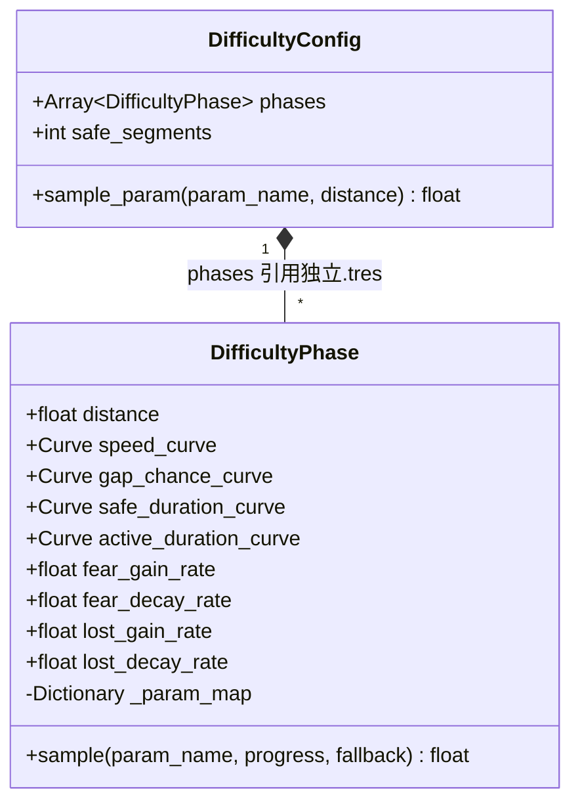

# 配置系统数据结构设计

> 本章节记录难度配置系统的 Resource 数据结构设计。  
> 核心思路：**每个阶段 = 一个独立的 `.tres` 文件**，顶层 Config 通过引用组装阶段序列。

## 设计原则

1. **每个阶段独立成文件** — 一个 `DifficultyPhase.tres` 包含该阶段的全部信息（持续距离 + 曲线 + 常量）
2. **`distance` 表示持续距离** — 每个阶段的 `distance` 表示该阶段持续多长距离（米），不再使用结束距离
3. **去掉 `distance_start`** — 阶段按序排列，起始距离由前面所有阶段的 `distance` 累加推算（第一个阶段从 0 开始）
4. **只有 2 个 Resource 类** — `DifficultyPhase` + `DifficultyConfig`，结构简洁
5. **全局常量提升到 Config 层** — 全程固定不随阶段变化的参数（如开局保护段数、断口基准速度等）只在 `DifficultyConfig` 中设置一次，不在每个 Phase 中重复
6. **最后阶段结束后数值冻结** — 所有阶段结束后，参数保持最后一个阶段末尾的值不再变化。无尽模式只需将最后阶段的曲线终点配置为极限值即可

---

## Resource 类关系

```
DifficultyConfig (.tres)                    ← 挂在 GameWorld 上
└── phases: Array[DifficultyPhase]          ← 按顺序引用多个独立 .tres 文件
    ├── [0] → warmup_phase.tres             ← 阶段0（持续 distance 米）
    ├── [1] → rising_phase.tres             ← 阶段1（持续 distance 米）
    └── [2] → climax_phase.tres             ← 阶段2（持续 distance 米，结束后数值冻结）
```



---

## `DifficultyPhase` — 单阶段配置

每个阶段保存为独立的 `.tres` 文件。

### 字段定义

| 分组 | 字段名 | 类型 | 默认值 | 说明 |
|------|--------|------|--------|------|
| **阶段区间** | `distance` | float | 200.0 | 该阶段持续的距离（米） |
| **玩家速度** | `speed_curve` | Curve | — | X: 阶段进度 0~1, Y: 速度 (m/s) |
| **道路断口** | `gap_chance_curve` | Curve | — | X: 阶段进度 0~1, Y: 概率 0~1 |
| **鬼怪波次** | `safe_duration_curve` | Curve | — | X: 阶段进度 0~1, Y: 安全期时长 (秒) |
| | `active_duration_curve` | Curve | — | X: 阶段进度 0~1, Y: 活跃期时长 (秒) |
| **恐惧/迷失常量** | `fear_gain_rate` | float | 10.0 | 睁眼看鬼时恐惧增速（本阶段固定值） |
| | `fear_decay_rate` | float | 3.0 | 闭眼时恐惧衰减速度（本阶段固定值） |
| | `lost_gain_rate` | float | 5.0 | 闭眼时迷失增长速度（本阶段固定值） |
| | `lost_decay_rate` | float | 4.0 | 睁眼时迷失衰减速度（本阶段固定值） |

### 内部参数映射表

运行时通过统一的 `_param_map` 字典将参数名映射到对应的值（Curve 或 float），采样时自动判断类型：

```
_param_map = {
    "speed"           → speed_curve,          # Curve
    "gap_chance"      → gap_chance_curve,      # Curve
    "safe_duration"   → safe_duration_curve,   # Curve
    "active_duration" → active_duration_curve,  # Curve
    "fear_gain_rate"  → fear_gain_rate,         # float
    "fear_decay_rate" → fear_decay_rate,        # float
    "lost_gain_rate"  → lost_gain_rate,         # float
    "lost_decay_rate" → lost_decay_rate,        # float
}
```

采样时自动判断值的类型：Curve 类型调用 `sample_baked(progress)`，float 类型直接返回常量值。

---

## `DifficultyConfig` — 阶段序列（顶层配置）

引用多个 `DifficultyPhase` 文件，组装成完整的难度配置。

### 字段定义

| 分组 | 字段名 | 类型 | 默认值 | 说明 |
|------|--------|------|--------|------|
| **阶段序列** | `phases` | Array[DifficultyPhase] | — | 有序阶段列表，每项引用一个独立的 `.tres` 文件 |
| **全局常量** | `safe_segments` | int | 3 | 开局保护段数，前 N 段路不出断口 |


> **全局常量**：这些参数全程固定不变，不随阶段推进而改变，因此只需在 Config 中设置一次。

### 核心采样逻辑（伪代码）

```
func sample_param(param_name, distance, fallback) -> float:
    1. 计算当前距离所在的阶段 phase 及阶段起始距离
    2. 如果当前距离已超出所有阶段：
       → 使用最后一个阶段，progress = 1.0（冻结在末尾值）
    3. 计算阶段内进度：
       local_progress = (distance - 阶段起始) / phase.distance，clamp到0~1
    4. 从 phase._param_map 中取值 val：
       a. val 是 Curve → 返回 val.sample_baked(local_progress)
       b. val 是 float → 直接返回 val
       c. val 不存在   → 返回 fallback
```

### 阶段起始距离推算

```
阶段[0] 起始 = 0
阶段[1] 起始 = 阶段[0].distance
阶段[2] 起始 = 阶段[0].distance + 阶段[1].distance
...
```

无需在每个阶段文件中重复定义 `distance_start`。

---

## 文件组织结构

```
res://Data/Difficulty/
├── phases/                           ← 阶段配置文件
│   ├── tutorial_phase.tres           ← 关卡模式 - 教学期
│   ├── rising_phase.tres             ← 关卡模式 - 上升期
│   ├── climax_phase.tres             ← 关卡模式 - 高潮期
│   ├── endless_warmup.tres           ← 无尽模式 - 热身期
│   ├── endless_normal.tres           ← 无尽模式 - 正常期
│   └── endless_climax.tres           ← 无尽模式 - 冲刺期（曲线终点 = 极限值）
│
└── configs/                          ← 模式配置（组装阶段序列）
    ├── level_1.tres                  ← 关卡1：教学期 → 上升期 → 高潮期
    ├── level_2.tres                  ← 关卡2：（另一套阶段组合）
    └── endless.tres                  ← 无尽模式：热身 → 正常 → 冲刺（结束后冻结）
```

---

## 配置示例

### 关卡模式（3 个阶段文件）

```
level_1.tres (DifficultyConfig)
└── phases:
    [0] → tutorial_phase.tres    distance: 100   (0~100m 教学期)
    [1] → rising_phase.tres      distance: 200   (100~300m 上升期)
    [2] → climax_phase.tres      distance: 200   (300~500m 高潮期，结束后数值冻结)
```

### 无尽模式（3 个阶段文件）

```
endless.tres (DifficultyConfig)
└── phases:
    [0] → endless_warmup.tres    distance: 200   (0~200m 热身期)
    [1] → endless_normal.tres    distance: 600   (200~800m 正常期)
    [2] → endless_climax.tres    distance: 700   (800~1500m 冲刺期，曲线终点配为极限值)
```

> **无尽模式说明**：所有阶段结束后（1500m 之后），参数冻结在最后阶段曲线终点的值。
> 只需将最后阶段的曲线终点配置为极限值（如安全期接近 0、断口概率接近 1），即可实现最大难度。

---

## 各组件使用方式

各系统只需一行调用即可获取当前参数值：

```gdscript
# Player 中
var speed = difficulty_config.sample_param("speed", distance, 8.0)
var fear_rate = difficulty_config.sample_param("fear_gain_rate", distance, 10.0)   # 常量，按阶段取值
var fear_decay = difficulty_config.sample_param("fear_decay_rate", distance, 3.0)   # 常量，按阶段取值
var lost_gain = difficulty_config.sample_param("lost_gain_rate", distance, 5.0)     # 常量，按阶段取值
var lost_decay = difficulty_config.sample_param("lost_decay_rate", distance, 4.0)   # 常量，按阶段取值

# RoadManager 中
var chance = difficulty_config.sample_param("gap_chance", distance, 0.3)

# GhostSpawner 中
var safe_dur = difficulty_config.sample_param("safe_duration", distance, 6.0)
var active_dur = difficulty_config.sample_param("active_duration", distance, 4.0)

```
